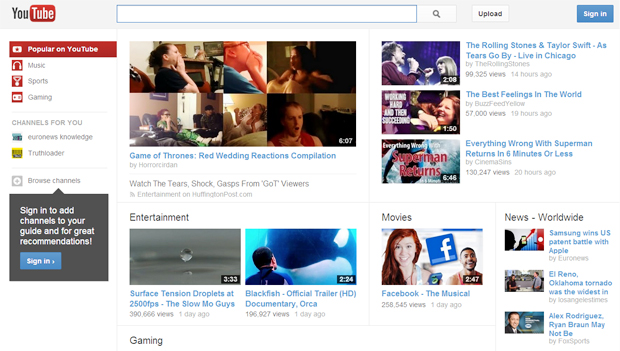
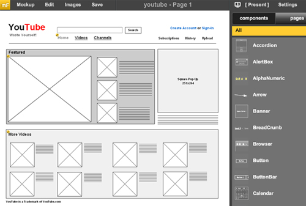

# Del Bosquejo al Código & HTML

  * Cómo interpretar un diseño
  * Diseño (Photoshop vs Mockups)
  * Historia de HTML
  * Estructura HTML
  * Etiquetas Básicas:
    * Textos
    * Encabezados
    * Div y Span
  * Etiquetas semánticas HTML5

# Cómo interpretar un diseño

Lo primero que nos preguntamos al comenzar a aprender programación para la web es: ¿cómo llevo un diseño a código? y la respuesta suele no ser tan sencilla. La web funciona hoy en día utilizando 3 lenguajes principales: HTML, CSS y Javascript, los cuales tienen sus roles claramente definidos:

* HTML: encargado de estructurar el contenido del sitios
* CSS: encargado de dar el estilo y de posicionar los elementos en la pantalla
* Javascript: a cargo de la inteligencia y dinamismo de la página

Para llevar nuestra idea a la realidad, primero debemos enfocarnos en los 2 primeros: HTML y CSS.

Existen 2 aproximaciones diferentes para traspasar nuestra ideas, bosquejos y/o diseños a código las cuales veremos en la siguiente sección.

# Diseño (Photoshop vs Mockups)

Veremos 2 maneras de traspasar nuestras ideas, bosquejos y/o diseños a código.

## Photoshop



Para los que vienen de un mundo más enfocado en el diseño, el trabajar con un archivo PSD como punto de partida es lo más sencillo. La transformación de un diseño establecido a código se basa en ir subdividiendo en pequeños bloques el diseño de manera de ir atomizando nuestro diseño para que el traspaso a un par de etiquetas de HTML sea lo más directo posible. Parte de este proceso es lo que veremos a lo largo de todo este curso.

### Ventajas

* Visualización del resultado esperado desde el día 1.
* Avances pequeños poseen mayor impacto en el resultado en procesos intermedio lo que aumenta la motivación
* No hay que estar en sincronía con el equipo de diseño para poder seguir avanzando debido a que el resultado final ya está definido.


## Mockups



El otro aproach se basa más en hacer un bosquejo dejando la parte estetica para una tapa posterior o bien en paralelo respecto al desarrollo del sitio web. Para ello al realizar un Mockups la preocupación principal va a radicar en el contenido y la estructura de este a grozo modo en nuestro sitio.

Existen diversas herramientas que hacen del proceso de generar un bosquejo algo más sencillo y estandarizado que simplemente tomar una hoja de papel y dibujar, dejando en claro que esto último es igual de válido.

### Ventajas

* Tanto diseñadores como programadores parten el trabajo de un punto en común lo que para equipos grandes permite el trabajo en paralelo.
* Llevar un bosquejo a una estructura HTML suele ser más sencillo debido a la simplicidad y "minimalismo" que estos tienen.
* Foco en la estructura y en como presentar el contenido en el espacio, ideal para trabajar la experiencia de usuario.

# Historia del HTML

El origen de HTML se remonta a 1980, cuando el físico Tim Berners-Lee, trabajador del CERN (Organización Europea para la Investigación Nuclear) propuso un nuevo sistema de "hipertexto" para compartir documentos.

Los sistemas de "hipertexto" habían sido desarrollados años antes. En el ámbito de la informática, el "hipertexto" permitía que los usuarios accedieran a la información relacionada con los documentos electrónicos que estaban visualizando. De cierta manera, los primitivos sistemas de "hipertexto" podrían asimilarse a los enlaces de las páginas web actuales.

Tras finalizar el desarrollo de su sistema de "hipertexto", Tim Berners-Lee lo presentó a una convocatoria organizada para desarrollar un sistema de "hipertexto" para Internet. Después de unir sus fuerzas con el ingeniero de sistemas Robert Cailliau, presentaron la propuesta ganadora llamada WorldWideWeb (W3).

El primer documento formal con la descripción de HTML se publicó en 1991 bajo el nombre HTML Tags (Etiquetas HTML) y todavía hoy puede ser consultado online a modo de reliquia informática.

La primera propuesta oficial para convertir HTML en un estándar se realizó en 1993 por parte del organismo IETF (Internet Engineering Task Force). Aunque se consiguieron avances significativos (en esta época se definieron las etiquetas para imágenes, tablas y formularios) ninguna de las dos propuestas de estándar, llamadas HTML y HTML+ consiguieron convertirse en estándar oficial.

En 1995, el organismo IETF organiza un grupo de trabajo de HTML y consigue publicar, el 22 de septiembre de ese mismo año, el estándar HTML 2.0. A pesar de su nombre, HTML 2.0 es el primer estándar oficial de HTML.

A partir de 1996, los estándares de HTML los publica otro organismo de estandarización llamado W3C (World Wide Web Consortium). La versión HTML 3.2 se publicó el 14 de Enero de 1997 y es la primera recomendación de HTML publicada por el W3C. Esta revisión incorpora los últimos avances de las páginas web desarrolladas hasta 1996, como applets de Java y texto que fluye alrededor de las imágenes.

HTML 4.0 se publicó el 24 de Abril de 1998 (siendo una versión corregida de la publicación original del 18 de Diciembre de 1997) y supone un gran salto desde las versiones anteriores. Entre sus novedades más destacadas se encuentran las hojas de estilos CSS, la posibilidad de incluir pequeños programas o scripts en las páginas web, mejora de la accesibilidad de las páginas diseñadas, tablas complejas y mejoras en los formularios.

# Estructura HTML

## El DOCTYPE

Cuando escribimos nuestro documento HTML, lo primero que tenemos que escribir es el **DOCTYPE**. El doctype declara el tipo de documento, es decir, nos sirve para indicar que nuestro documento está escrito siguiendo la estructura determinada por un DTD concreto.

### ¿Qué es el DTD que utilizamos en el Doctype?
Un **DTD** es la definición del tipo de documento. El doctype que es la forma de declarar el tipo de documento.

Así que, el DTD es dónde se define la estructura que debe tener el documento y utilizamos el doctype para informar qué DTD usamos.

### El doctype en HTML5
A partir de HTML5 la declaración del doctype es notablemente más sencilla, sólo basta con encabezar nuestro documento con la siguiente etiqueta.

```
<!DOCTYPE html>
```

## Estructura básica de un HTML

Usaremos 3 tags para definir la estructura principal de un HTML, ellos son:

* ```<html>```: Esta etiqueta delimita el contenido del documento e indica en que lenguaje está escrito.

* ```<head>```: Es la parte privada del documento, se utiliza como un espacio de comunicación entre el sitio web y el navegador para configuración de la visualización del sitio.

* ```<body>```: Encierra el contenido propiamente dicho del sitio.

Una vez definida la estructura principal, veremos otras etiquetas básicas de HTML.

* ```<title>```: La etiqueta title define el título de nuestra página, que será visualizado en la solapa del navegador.

* ```<meta>```: Con esta etiqueta definiremos que codificación de caracteres utilizará nuestro sitio.

Utilizaremos todas estas etiquetas en nuestro primero ejemplo de estructura web:

```html
<!DOCTYPE html>
    <html>
        <head>
            <meta charset="UTF-8">
            <title>Mi primer sitio web</title>
        </head>
        <body>
            ¡Este es mi primer sitio web!
        </body>
    </html>
```
[Ejercicio Profesor DOCTYPE](../ejercicios-profesores/ejercicios 1.md#1)

# Etiquetas Básicas

## Sintaxis HTML

El elemento principal del html es el de etiqueta, éstas sirven para especificar el tipo de contenido al navegador.

Las etiquetas se dividen en cerradas y abiertas.

Las  cerradas  encierran un contenido, por lo general texto. Las abiertas no encierran contenido, y sirven, entre otras cosas, para incluir elementos como imágenes, líneas, etc.

```
<p>Este es un párrafo con texto en su interior</p>
<hr/>
```

En el ejemplo tenemos una etiqueta cerrada parrafo que engloba un texto y una etiqueta abierta para incluir una línea horizontal.
El signo **/** se utiliza para las etiquetas de cierre; en las etiquetas cerradas se pone a continuación  del signo **<**, en las abiertas se pone delante del signo **>**.

### Tags Encabezados

* ```<html>```: Define un documento HTML

* ```<body>```: Define el *body*  del documento

* ```<head>```: Define el *head* del documento  

* ```<h1> a <h6>```: Define encabezados, donde el ```<h1>```es el de mayor importancia y ```<h6>``` el de menor importancia

* ```<hr>```: Define una línea horizontal

* ```<p>```: Define un párrafo

* ```<br>```: Inserta un salto de línea simple

* ```<pre>```: Define un texto con formato pre definido, con texto justificado, tipografía Courier y respeta espacios y saltos de línea.

### Tags Formato

* ```<b>```: Define el texto en <b>Negrita</b>.

* ```<em>```: Define un texto enfatizado para textos o palabras con <em>importancia semántica</em>.

* ```<i>```: Define el texto en <i>Cursiva</i>.

* ```<small>```: Define el texto más <small>pequeño</small>.

* ```<strong>```: Define el texto con <strong>mayor importancia</strong>.

* ```<sub>```: Define el texto <sub>subindice</sub>.

* ```<sup>```: Define el texto con <sup>superindice</sup>.

* ```<del>```: Defines el texto <del>tachado</del>.

* ```<mark>```: Define el texto <mark>resaltado</mark>.

[Ejercicio Profesor Formato](../ejercicios-profesores/ejercicios_1.md#2)

### Tags de usos múltiples

Existen dos etiquetas las cuales son utilizadas principalmente para dar formato y orden, podríamos decir que son etiquetas "comodín", estas son:

* ```<div>```: Define un bloque de información sin formato predefinido
* ```<span>```: Define un elemento en linea sin formato predefinido

Con la introducción de las etiquetas semanticas, la utilización de estas etiquetas se ha disminuido un poco debido a que gran parte de su uso era principalmente enfocado en estructurar nuestros sitios web.

# Etiquetas Semánticas
HTML5 incorpora etiquetas semánticas que no sólo generan estructura, si no que también define su contenido.


### Etiquetas
* ```<section>```: Define una sección en un documento.
* ```<nav>```: Define un bloque quecontiene enlaces de navegación, como por ejemplo el menú.
* ``` <article>```: Define contenido autónomo que podría existir independientemente del resto del contenido.
* ```<aside>```: Define contenidos vagamente relacionados con el resto del contenido de la página.
* ```<main>```: Define el contenido principal o importante en el documento. Solamente existe un elemento ```<main>``` en el documento.
* ```<header>```: Define la cabecera de una página o sección.
* ```<footer>```: Define el pie de una página o sección.

[Ejercicio Profesor Etiquetas Semanticas](../ejercicios-profesores/ejercicios_1.md#3)
