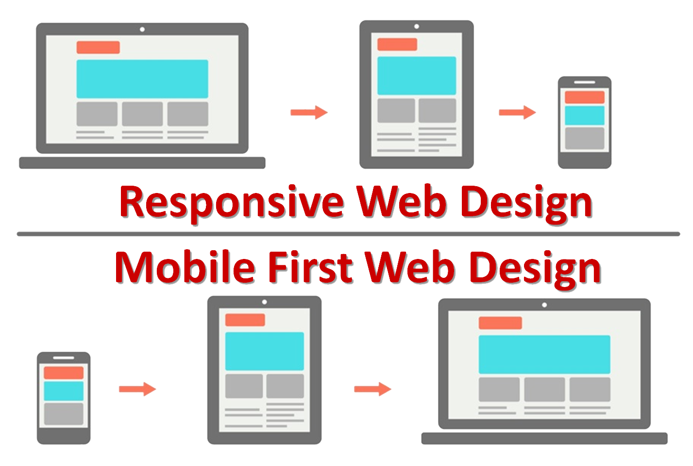

# Diseño Responsivo, Media Queries, Git.Github

  * ¿Qué es un diseño responsivo?
  * Pantallas en que enfocarse
  * Mobile-First
  * Utilización, media queries
  * ¿Qué es Git?
  * ¿Qué es Github?
  * Crear una cuenta
  * Crear un repositorio
  * Clonar un repositorio

# ¿Qué es un diseño responsivo?

Cuando se habla de Responsive Design o de Diseño Responsivo en una página web, se refiere a que el contenido de la página se adapta al tamaño de pantalla en donde accede nuestro usuario final, sin cambiar nuestro contenido del HTML original si no que más bien simplemente modificando el diseño en que mostramos este contenido. Esto a diferencia de antiguamente en donde al acceder desde un dispositivos móviles, muchos sitios web utilizaban la filosofía de redirigirnos a una versión móvil explisiva del sitio (e.g. httP://m.example.com) en donde los contenidos de la versión móvil y la versión de escritorio no eran los mismos además del trabajo que presenta mantener 2 o más versiones del mismo sitio web en paralelo.

Para eliminar dichas practicas, en CSS3 se nos incorpora los Media queries, para adaptar el contenido en base al tamaño en donde se va a desplegar el nuestro sitio web.


# Pantallas en que enfocarse

Al utilizar media queries, surge la duda de cuales son los tamaños que debemos considerar para hacer los cambios de diseño. Aquí dejamos los estandares más comunes:

* Muy Pequeña: 480px
* Pequeña: 768px
* Mediana: 992px
* Large: 1200px



# Mobile First

Finalmente, tenemos el concepto de Mobile First.

Con el fin de optimizar el uso de la red y la rapidez con la cual nuestros sitios web son renderizados en los dispositivos móviles, es que surge el concepto de Mobile First. Esto consiste en ir agregando/mostrando contenido a medida que el tamaño de la pantalla va creciendo, al contrario de un acercamiento tradicional a un diseño responsivo en donde nuestro sitio base va ocultando contenido a medida que accedemos a un dispositivo más pequeño. Si bien las diferencias en resultado visual no presentan diferencia alguna, el enfocarse en mobile first, la cantidad de contenido necesario para desplegar un sitio web en un móvil es menor lo que aumenta la percepción de velocidad del sitio por parte del usuario, entregando una mejor UX.

# Utilización, media queries

Los media types permiten indicar una serie de estilos que se aplicarán según el tipo del medio, en algunas páginas, al ver el código fuente, nos encontramos algo como lo siguiente en su head

Las **media queries** son propias de CSS3 y vienen a extender a los media, utilizando un media type con una serie de expresiones relacionadas con las características del dispositivo desde el cual se accede a la web. Las media queries dan como resultado verdadero o falso. Si el resultado es verdadero, se leen las reglas CSS de su interior, si es falso no.

Ejemplo:

```
@media (max-width: 600px) {
}
```

Este sencillo ejemplo tiene una media query que significa lo siguiente:

Cuando el ancho de la pantalla tenga un ancho menor a 600px lees el código encerrado dentro de las llaves que abren y cierran la media querie.

Ejemplo:

```
body {
  background: green;
}
```

```
@media (max-width: 600px) {
  body {
  background: red;
  }
}
```

Esto hará que el fondo de la web sea verde, pero cuando la pantalla sea menor a 600px el fondo será rojo.

Las posibilidades y combinaciones son muchas y su uso está generalizado. Bootstrap o Foundation son sólo dos ejemplos de frameworks CSS que basan todo su funcionamiento en las media queries, lo que nos permite tener webs adaptables.

Al igual que hay varios media types, las media queries tienen varias expresiones a utilizar, las más interesantes para el responsive design son:

* **orientation**: permite tomar por valores landscape o portrait lo que significa que la orientación sea horizontal o vertical, o sea, landscape si la ventana es más ancha que alta y portrait si es más alta que ancha.
* **resolution**: Permite las variantes ```min-resolution``` y ```max-resolution```. El valor que toma es la densidad de la pantalla en valor de puntos por pulgada (dpi) o en puntos por pixel (dppx). Su uso principal es para cambiar los background de imágenes según el dispositivo sea de alta resolución (como los retina display, iphone, …) o normal para que no se carguen más datos de los necesarios.
* **width**: El alto del dispositivo. Se permiten las variantes ```min-width``` y ```max-width```. Es la principal expresión para el responsive design.

# ¿Qué es Git?
Git es un sistema de control de versiones, gratuito y de código abierto, diseñado para manejar desde pequeños a grandes proyectos de manera rápida y eficaz. Se entiende como control de versiones a todas las herramientas que nos permiten hacer modificaciones en nuestro código y hacen que sea más fácil la administración de las distintas versiones de cada producto desarrollado.

# ¿Qué es GitHub?
Github es un servicio para alojamiento de repositorios de software gestionados por el sistema de control de versiones Git. Github es un sitio web pensado para hacer posible el compartir el código de una manera más fácil y al mismo tiempo darle popularidad a la herramienta de control de versiones en sí, que es Git. Cabe destacar que Github es un proyecto comercial, a diferencia de la herramienta Git que es un proyecto de código abierto.

# Crear una cuenta
1. Descargar e instalar la última versión de <a href=https://desktop.github.com target=_blank>GitHub Desktop</a>. Al finalizar la instalación el sistema lo mantendrá actualizado a la última versión.
2. Desde la computadora, abrir la aplicación **Git Shell**
3. En primera instancia se debe igresar el nombre del usuario en Git para que al momento de hacer commit, todo quede correctamente etiquetado. Se deberá escribir todo después del símbolo ```$```.
```
$ git config --global user.name "NOMBRE"
```
4. Se deberá ingresar una dirección de email que quedará asociada a tus commits de Git.
```
$ git config --global user.email "EMAIL"
```

# Crear un nuevo repositorio en GitHub

En GitHub, se pueden guardar toda clase de proyectos en repositorios. Los repositorios personales pertenecen a las cuentas de los usuarios, así que luego de haber creado una cuenta y entrar al sistema, ya podemos crear nuestor primer repositorio.
Los pasos son los siguientes:

1. Situándonos en el menú principal, en la esquina superior derecha, podemos ver un ícono de **+** donde se despliegan diferentes opciones. La primera es "Nuevo repositorio".
2. Debemos elegir un nombre para el repositorio. Se recomiendan nombres cortos y fáciles de recordar.
3. Podemos agregar, de manera opcional, una breve descipción del repositorio. Por ejemplo: "Este es mi primer repositorio en GitHub".
4. Luego debemos elegir si el repositorio será Público o Privado.
- Público: Estará visible para cualquier usuario de GitHub.
- Privado: Se encontrará disponible sólamente para nosotros, los dueños del repositorio, y para aquellas personas con las que decidamos compartirlo.
5. Seleccionamos la opción Iniciar el reposito con un archivo Léeme.
6. Crear el repositorio.
¡Ya está! Con estos pocos pasos ya creamos el repositorio. En la siguiente imagen se verán todos los puntos mencionados anteriormente.


# Clonar repositorios localmente

Cuando creamos un repositorio en GutHub, éste existe como un repositorio remoto. Existe la posibilidad de crear una copia o clon del repositorio de manera local y sincronizar el mismo entre ambos lugares.

1.  Ingresamos a GitHub y nos situamos en el menú principal.
2.  Debajo del nombre de un repositorio existente, clickeamos el ícono para colonar la URL del repositorio.
3.  Abrimos Terminal (para usuarios de Mac o Lunux), o el Símbolo de sistema (para usuarios de Windows).
4.  Ubicamos el directorio donde queremos que se genere el repositorio clonado.
5.  Tipear git clone /* en código */, y luego copiar la URL que tomamos en el Paso 2.
```
$ git clone https://github.com/USUARIO/REPOSITORIO
```
6. Presionar Enter, y el repositorio local se creará.

```
$ git clone https://github.com/USUARIO/REPOSITORIO
Cloning into `Location`...
remote: Counting objects: 10, done.
remote: Compressing objects: 100% (8/8), done.
remove: Total 10 (delta 1), reused 10 (delta 1)
Unpacking objects: 100% (10/10), done.
```

## Clonar usando la aplicación de escritorio

Para esto necesitamos intalar la <a href=https://desktop.github.com/ target=_blank>aplicación de escritorio</a>

1. Ingresamos a GitHub y nos situamos en el menú principal.
2. Debajo del nombre de un repositorio existente, clickeamos el ícono para colonar la URL del repositorio.


3. Dentro de la aplicación de escritorio, luego de verificar el nombre y el directorio en la unidad de disco donde queremos que se encuentre el repositorio clonado, clickeamos el botón Clonar.


# Conectar un repositorio local con tu repositorio en GitHub
El beneficio de tener un repositorio local es una manera efectiva de poder hacer modificaciones sin siquiera tener que estar conectado a internet. Luego, se puede subir el trabajo terminado a GitHub para que esté diponible para todos los usuarios.

Asumiendo que, por ejemplo, tenemos en GitHub un repositorio ubicado en https://github.com/usuario/ejemplo.git, la construccción sería:

```git remote add origin https://github.com/username/myproject.git```

* Modificamos "usuario" con tu usario real de GitHub.
* Modificamos "ejemplo" con el nombre real del repositorio en GitHub.
* Para informar a Git que el repositorio remoto realmente existe en algún lugar de internet utilizamos ```git add```.
* El código ```origin``` indica que esos archivos van a tener un nuevo destino.
* ```remote``` describe al código ```origin``` ya que va a estar subido de manera remota y no se va a tratar de un directorio local.

Para verificar, usamos: ```git remote -v```.

Para subir (“push”) nuestros cambios usamos ```git push```.
